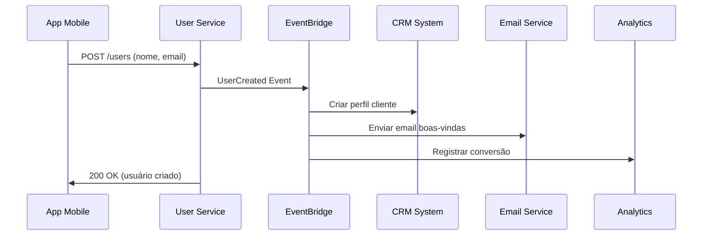

# 📚 Exemplos Práticos de Uso

## 🏪 Caso de Uso: E-commerce

### Cenário

Uma loja online precisa sincronizar dados de clientes entre múltiplos sistemas quando um novo usuário se cadastra.

### Fluxo



### Implementação

```javascript
// Evento publicado pelo User Service
{
  "source": "user-service",
  "detailType": "UserCreated",
  "detail": {
    "userId": "12345",
    "name": "Ana Silva",
    "email": "ana@email.com",
    "signupDate": "2025-10-29T13:45:00Z",
    "source": "mobile-app"
  }
}
```

## 🏦 Caso de Uso: Fintech

### Cenário

Um app financeiro precisa processar transações e notificar múltiplos sistemas para compliance.

### Benefícios

- ✅ **Auditoria completa** de todas as transações
- ✅ **Processamento assíncrono** sem afetar UX
- ✅ **Escalabilidade** para milhões de transações
- ✅ **Recuperação** automática de falhas

## 🚀 Caso de Uso: SaaS Platform

### Cenário

Uma plataforma SaaS precisa sincronizar dados de usuários entre billing, support e product analytics.

### Vantagens

- 🔄 **Consistência** de dados entre serviços
- 📊 **Analytics** em tempo real
- 💰 **Billing** automático baseado em eventos
- 🎯 **Personalização** de experiência
