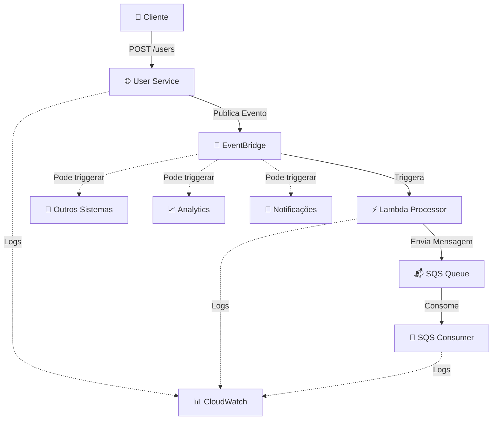

# 🚀 Data Sync PoC - Sistema de Sincronização de Dados

## 📖 Visão Geral

Este projeto demonstra uma **arquitetura de eventos robusta e escalável** para sincronização de dados em tempo real, utilizando os melhores padrões da AWS para sistemas distribuídos modernos.

### 🎯 **Para que serve?**

O **Data Sync PoC** é uma solução completa para cenários onde você precisa:

- **📨 Capturar eventos de negócio** (ex: criação de usuários, pedidos, transações)
- **🔄 Processar dados de forma assíncrona** sem impactar a experiência do usuário
- **📡 Distribuir informações** para múltiplos sistemas e serviços
- **🔍 Garantir rastreabilidade** e auditoria de todas as operações
- **⚡ Escalar horizontalmente** conforme a demanda cresce

### 💼 **Casos de Uso Reais**

1. **E-commerce**: Sincronizar dados de clientes entre CRM, sistema de marketing e analytics
2. **Fintech**: Processar transações e notificar sistemas de compliance e auditoria
3. **SaaS**: Integrar dados de usuários entre múltiplos microserviços
4. **IoT**: Processar eventos de sensores e distribuir para dashboards e alertas
5. **Marketplace**: Sincronizar inventário entre vendedores e sistema central

## 🏗️ Arquitetura



### 🧩 **Componentes do Sistema**

| Serviço                 | Responsabilidade                        | Tecnologia                     |
| ----------------------- | --------------------------------------- | ------------------------------ |
| **🌐 User Service**     | API REST para receber dados de usuários | Node.js + Express + TypeScript |
| **📡 EventBridge**      | Roteamento inteligente de eventos       | AWS EventBridge (LocalStack)   |
| **⚡ Lambda Processor** | Processamento assíncrono de eventos     | AWS Lambda + Node.js           |
| **📬 SQS Queue**        | Fila de mensagens confiável             | AWS SQS (LocalStack)           |
| **🔄 SQS Consumer**     | Processamento final das mensagens       | Node.js + AWS SDK              |

## 🚀 Como executar

### 📋 **Pré-requisitos**

- ✅ **Docker & Docker Compose** (obrigatório)
- ✅ **Node.js 18+** (para desenvolvimento local)
- ✅ **PowerShell** (Windows) ou **Bash** (Linux/Mac)

### ⚙️ **1. Configuração Inicial**

```bash
# Clone o repositório
git clone <url-do-repositorio>
cd data_sync_poc

# Copie o arquivo de configuração
cp .env.example .env
```

### 🐳 **2. Executar com Docker (Recomendado)**

```bash
# Subir todos os serviços
docker-compose up -d

# Aguardar inicialização (30-45 segundos)
# Verificar status dos containers
docker-compose ps
```

### 🧪 **3. Testar o Sistema**

#### **Método 1: Script Automatizado**

```bash
# Windows
.\test-simple.ps1

# Linux/Mac
chmod +x test-simple.sh && ./test-simple.sh
```

#### **Método 2: Testes Manuais**

**Health Check:**

```bash
curl http://localhost:3000/health
```

**Criar Usuário:**

```bash
curl -X POST http://localhost:3000/users \
  -H "Content-Type: application/json" \
  -d '{
    "name": "Ana Silva",
    "email": "ana@empresa.com"
  }'
```

**Resposta Esperada:**

```json
{
  "message": "Usuário criado com sucesso! (EventBridge simulado)",
  "user": {
    "name": "Ana Silva",
    "email": "ana@empresa.com"
  },
  "simulatedEvent": {
    "eventBusName": "user-events-bus",
    "source": "user-service",
    "detailType": "UserCreated",
    "detail": {
      "name": "Ana Silva",
      "email": "ana@empresa.com"
    },
    "timestamp": "2025-10-29T13:45:00.000Z"
  }
}
```

## 📡 API Reference

### **POST /users**

Cria um novo usuário e publica evento no EventBridge.

**Request Body:**

```json
{
  "name": "string (obrigatório, não vazio)",
  "email": "string (obrigatório, formato válido)"
}
```

**Responses:**

- `200` - Usuário criado com sucesso
- `400` - Dados inválidos (validação)
- `500` - Erro interno do servidor

### **GET /health**

Health check do serviço.

**Response:**

```json
{
  "status": "OK",
  "service": "user-service",
  "timestamp": "2025-10-29T13:45:00.000Z"
}
```

## 📁 Estrutura do Projeto

```
data_sync_poc/
├── 📂 user-service/           # 🌐 API REST (Ponto de entrada)
│   ├── 📂 src/
│   │   ├── index.ts          # Servidor Express principal
│   │   ├── index-simple.ts   # Versão simplificada (atual)
│   │   └── index-with-eventbridge.ts # Versão com EventBridge real
│   ├── package.json          # Dependências Node.js
│   ├── tsconfig.json         # Configuração TypeScript
│   └── Dockerfile            # Container configuration
│
├── 📂 lambda-processor/       # ⚡ Processador de Eventos
│   ├── 📂 src/
│   │   └── index.ts          # Função Lambda
│   ├── package.json
│   ├── tsconfig.json
│   └── Dockerfile
│
├── 📂 sqs-consumer/          # 🔄 Consumidor de Mensagens
│   ├── 📂 src/
│   │   └── index.ts          # Worker de processamento
│   ├── package.json
│   ├── tsconfig.json
│   └── Dockerfile
│
├── 🐳 docker-compose.yml     # Orquestração de containers
├── 📋 .env.example          # Variáveis de ambiente template
├── 🔧 setup-aws-infrastructure.ps1  # Script Windows
├── 🔧 setup-aws-infrastructure.sh   # Script Linux/Mac
├── 🧪 test-simple.ps1       # Testes automatizados
└── 📖 README.md             # Esta documentação
```

## 🛠️ Tecnologias Utilizadas

### **Backend & APIs**

-  **Node.js 18+** - Runtime JavaScript
-  **TypeScript** - Tipagem estática
-  **Express.js** - Framework web

### **Cloud & Infrastructure**

-  **AWS EventBridge** - Event routing
-  **AWS SQS** - Message queuing
-  **AWS Lambda** - Serverless computing
-  **LocalStack** - AWS simulation

### **DevOps & Development**

-  **Docker & Docker Compose** - Containerization
-  **PowerShell/Bash** - Automation scripts

## 🔧 Desenvolvimento Local

### **Opção 1: Desenvolvimento Completo com Docker**

```bash
# Subir todos os serviços
docker-compose up -d

# Ver logs em tempo real
docker-compose logs -f user-service
docker-compose logs -f sqs-consumer
```

### **Opção 2: Desenvolvimento Híbrido**

```bash
# Subir apenas infraestrutura
docker-compose up -d localstack

# Executar serviços localmente
cd user-service
npm install && npm run dev

# Em outro terminal
cd sqs-consumer
npm install && npm run dev
```

### **📊 Monitoramento e Logs**

**Ver logs de um serviço específico:**

```bash
docker-compose logs -f user-service --tail=50
```

**Ver status de todos os containers:**

```bash
docker-compose ps
```

## 🌟 Funcionalidades Implementadas

### ✅ **Core Features**

- [x] 🌐 **API REST completa** com validações robustas
- [x] 📝 **Validação de dados** (nome obrigatório, email válido)
- [x] 🔄 **Simulação de EventBridge** com logs estruturados
- [x] 🏥 **Health checks** para monitoramento
- [x] 🐳 **Containerização completa** com Docker
- [x] 📊 **Logs estruturados** para debugging
- [x] 🧪 **Testes automatizados** de validação

### 🔮 **Próximas Funcionalidades**

- [ ] 📡 **Integração real com EventBridge**
- [ ] ⚡ **Lambda function ativa** para processamento
- [ ] 📬 **SQS consumer operacional**
- [ ] 🔐 **Autenticação e autorização**
- [ ] 📈 **Métricas e observabilidade**
- [ ] 🧪 **Testes unitários e integração**
- [ ] 🚀 **CI/CD pipeline**

## 🎭 Cenários de Teste

### **✅ Cenário 1: Criação de Usuário Válido**

```bash
# Request
POST /users
{
  "name": "Maria Silva",
  "email": "maria@empresa.com"
}

# Response esperada: 200 OK
{
  "message": "Usuário criado com sucesso!",
  "user": { "name": "Maria Silva", "email": "maria@empresa.com" },
  "simulatedEvent": { ... }
}
```

### **❌ Cenário 2: Validação de Nome**

```bash
# Request
POST /users
{
  "name": "",
  "email": "maria@empresa.com"
}

# Response esperada: 400 Bad Request
{
  "error": "Nome é obrigatório e deve ser uma string válida"
}
```

### **❌ Cenário 3: Validação de Email**

```bash
# Request
POST /users
{
  "name": "Maria Silva",
  "email": "email-invalido"
}

# Response esperada: 400 Bad Request
{
  "error": "Email é obrigatório e deve ter um formato válido"
}
```

## 🚨 Troubleshooting

### **🔧 Problemas Comuns**

**1. Container não inicia**

```bash
# Verificar logs
docker-compose logs <service-name>

# Rebuildar imagem
docker-compose build --no-cache <service-name>
```

**2. Porta já em uso**

```bash
# Verificar processos na porta 3000
netstat -ano | findstr :3000  # Windows
lsof -i :3000                 # Linux/Mac

# Parar containers
docker-compose down
```

**3. LocalStack não responde**

```bash
# Aguardar inicialização completa
docker-compose logs localstack | grep "Ready"

# Reiniciar se necessário
docker-compose restart localstack
```

### **📞 Como pedir ajuda**

1. Execute `docker-compose ps` e inclua o output
2. Execute `docker-compose logs <service>` para logs específicos
3. Inclua a mensagem de erro completa
4. Mencione o sistema operacional utilizado

## 🤝 Contribuindo

1. **Fork** o repositório
2. **Crie** uma branch para sua feature (`git checkout -b feature/nova-funcionalidade`)
3. **Commit** suas mudanças (`git commit -am 'Adiciona nova funcionalidade'`)
4. **Push** para a branch (`git push origin feature/nova-funcionalidade`)
5. **Abra** um Pull Request

## 📄 Licença

Este projeto está sob a licença MIT. Veja o arquivo [LICENSE](LICENSE) para mais detalhes.

## 👥 Equipe

- **Desenvolvedor Principal**: [Seu Nome]
- **Arquitetura**: Sistema baseado em eventos AWS
- **Tecnologia**: Node.js + TypeScript + Docker

---

### 🌟 **Star o projeto** se ele foi útil para você!

### 📧 **Dúvidas?** Abra uma [issue](../../issues) que responderemos rapidamente.

---

**📚 Documentação adicional:** [Wiki do Projeto](../../wiki)
